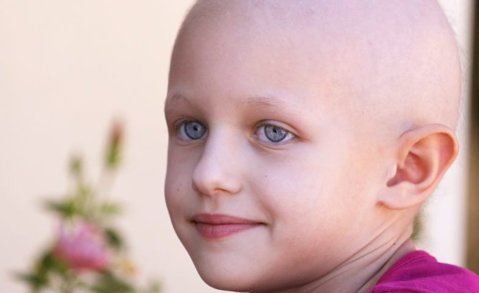

# Leukemia Classification

Veronica Agnolutto | Data PT Barcelona Jun 2020

 

 *It’s not some kind of miracle, cancer doesn’t grow from yesterday to today. It’s a pretty long process. There are signs in the tissue, but the human eye has limited ability to detect what may be very small patterns.*

 Regina Barzilay,  first winner of the Squirrel AI Award for Artificial Intelligence for the Benefit of Humanity  

  <a href="https://www.news-medical.net/health/Childhood-Acute-Lymphoblastic-Leukemia.aspx">
    
Source: news-medical.net
    

  </a>

## Contents

- [Overview](#Overview)
  - [Data](#Data)
  - [Description of the Dataset](#Description_of_the_Dataset)
- [Objective](#Objective)

- [Workflow](#Workflow)
  - [Cloud](#Cloud)
  - [Link](#Link)

- [Project structure](#Project_structure)
- [Tools](#Tools)
  - [System](#System)
  - [Libraries](#Libraries)
- [References](#References)

## Overview

[Acute lymphoblastic leukemia (ALL)](https://en.wikipedia.org/wiki/Acute_lymphoblastic_leukemia)  is the most common type of childhood cancer and accounts for approximately 25% of the pediatric cancers.

These cells have been segmented from microscopic images and are representative of images in the real-world because they contain some staining noise and illumination errors, although these errors have largely been fixed in the course of acquisition.

The task of identifying immature leukemic blasts from normal cells under the microscope is challenging due to morphological similarity and thus the ground truth labels were annotated by an expert oncologist.

### Data

Data are obtained from a  [Kaggle dataset](https://www.kaggle.com/andrewmvd/leukemia-classification) with more than 15,000 images, some of them of young patients affected by leukemia and others with no leukemia.

In total there are **15,135 images** from **118 patients** with two **labelled classes**:

- **Normal cell**
- **Leukemia blast**

### Description of the Dataset

**C-NMC Leukemia** (Classification  of Normal vs Malignant Cells) is a folder that contains the data arranged in three folds:

- training_data (images)
  - fold_0
    - all
    - hem
  - fold_1
    - all
    - hem
  - fold_2
    - all
    - hem

- testing_data (images)
  - C-NMC_test_final_phase_data

- validation_data
  - C-NMC_test_preliminar_phase_data (images)
  - C-NMC_test_preliminar_phase_data.csv

where:
  - all: Leukemia
  - hem: normal (healty)

The ground truth labels of the final test set are not provided.

## Objective

Tackle one of the major childhood cancer types by **creating a model to classify normal from abnormal cell images**.

 

## Workflow

### Cloud

This project was done entirely in the **cloud**, using:

- **Google Drive**: cloud to store files
- **Google Colab**: platform
- **Python Compiler Editor**: run Python code in your browser directly

**Google Colab** is an online cloud based platform based on the Jupyter Notebook framework, designed mainly for use in ML and deep learning operations.

Other advantage of **Colab** is data versatility, allowing to ‘mount’ Google Drive onto your notebook.

### Link
To access the entire project, please open the following link:
https://drive.google.com/drive/folders/1Tf5HlAoWrl_actixBloP_wcrP0V2pU92?usp=sharing

 

## Project structure  

### GitHub
- **PR07_readme.md** Description of the project.
- **link_drive.txt**

### Google Drive
- **src** Images and resources.
- **input** Folder containing the original data.
- **notebooks**
  - **modules**
  - **0.utility**
  - **1.EDA**

* **output** Folder containing the final models.
* **.gitignore**

## Tools

**System**

- **Processor**: Intel(R) Core(TM)i7-8750H CPU @ 2.20gHz
- **RAM**: 16Gb

**Libraries**

- File management: os, importlibmachinery, shutil, glob
- Google: drive,colab
- Data Analysis: Numpy, Pandas
- Image manipulation: OpenCV, PIL
- Visualization: Matplotlib, Seaborn
- Neural Networks: TensorFlow|Keras
- Metrics: scikit-learn

## References

**Google Colab**
- [Google Colab](https://medium.com/swlh/machine-learning-google-colab-why-when-and-how-to-use-it-9624e34abd6d)

**Machine Learning**

**Deep Learning**
- [Deep Learning and Medical Image Analysis with Keras](https://www.pyimagesearch.com/2018/12/03/deep-learning-and-medical-image-analysis-with-keras/)
- [Deep learning with Python-François Chollet](https://www.manning.com/books/deep-learning-with-python?a_aid=keras&a_bid=76564dff)
- GitHub: [deep-learning-with-python-notebooks](https://github.com/fchollet/deep-learning-with-python-notebooks)
