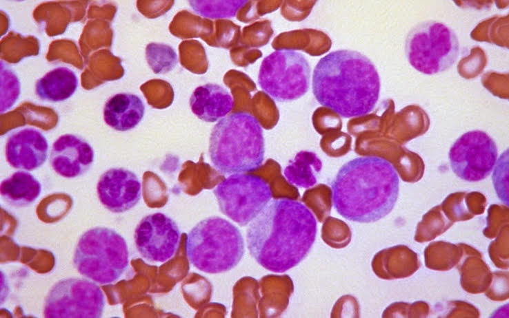
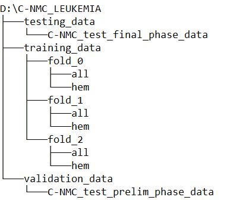
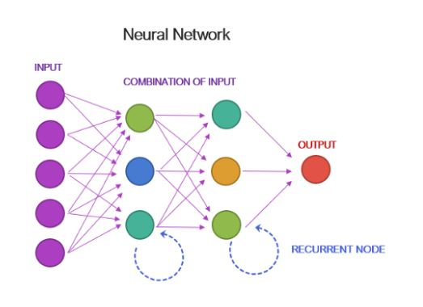

# Leukemia Classification

Veronica Agnolutto | Data PT Barcelona Jun 2020

 

 *It’s not some kind of miracle, cancer doesn’t grow from yesterday to today. It’s a pretty long process. There are signs in the tissue, but the human eye has limited ability to detect what may be very small patterns.*

  Regina Barzilay, 
  first winner of the Squirrel AI Award for AI for the Benefit of Humanity  

  

## Contents

- [Overview](#Overview)
  - [Data](#Data)
  - [Description of the Dataset](#Description_of_the_Dataset)
- [Goal](#Goal)

- [Link](#Link)

- [ANNa](#ANNa)
  - [Meet ANNa](#Meet_ANNa)
      - [U-Net](#U-Net)
      - [ANNa's engineering](#ANNa's_engineering)
      - [Performance Charts](#Performance_Charts)
      - [Conclusions](#Conclusions)
      - [Future Improvements](#Future_Improvements)

- [Project structure](#Project_structure)

- [Tools](#Tools)
  - [Cloud](#Cloud)
  - [Libraries](#Libraries)

- [References](#References)

## Overview

[Acute lymphoblastic leukemia (ALL)](https://en.wikipedia.org/wiki/Acute_lymphoblastic_leukemia)  is the most common type of childhood cancer and accounts for approximately 25% of the pediatric cancers.

These cells have been segmented from microscopic images and are representative of images in the real-world because they contain some staining noise and illumination errors, although these errors have largely been fixed in the course of acquisition.

The task of identifying immature leukemic blasts from normal cells under the microscope is challenging due to morphological similarity and thus the ground truth labels were annotated by an expert oncologist.

### Data

Data are obtained from a  [Kaggle dataset](https://www.kaggle.com/andrewmvd/leukemia-classification) with more than 15,000 images, some of them of young patients affected by leukemia and others with no leukemia.

In total there are **15,135 images** from **118 patients** with two **labelled classes**:

- **Normal cell**
- **Leukemia blast**

### Description of the Dataset

**C-NMC Leukemia** (Classification  of Normal vs Malignant Cells) is a folder that contains the data arranged in three folds:

where:
  - all: Leukemia cells
  - hem: Normal (healthy) cells

We will use **training_data** to train the model and **validation_data** to evaluate it because it contains labeled images.

We won't use **testing_data** because images are not labeled and not useful for our project.

## Goal

Tackling one of the major types of childhood cancer by creating a **model** that **classifies** between **diseased** and **healthy cells**.

To do this, we use  **Neural Networks**, a computer system modeled on the **human brain** and **nervous system**.

 

## Link
To access the entire project, please open the following link:
https://drive.google.com/drive/folders/1Tf5HlAoWrl_actixBloP_wcrP0V2pU92?usp=sharing

 

## ANNa

To achieve our goal, we create **ANNa**, an **Artificial Neural Network anti-Leukemia**.

**ANNa** is the combination of a **Convolutional Network** for **Biomedical Image Segmentation** (**U-Net**) and a Traditional **Neural Network** for **Binary Classification**.

We choose Convolutional Neural Networks because they are a category of Neural Networks that have proven very effective in areas such as image recognition and classification.

### Meet ANNa's Brain

Let's discover **ANNa's Brain**!

In **Medical testing**, **Binary classification** is used to determine if a patient has certain disease (in our case, **Leukemia**) or not.

For this reason, we create a **Brain** made up of two parts:

- 1. **U-Net**: **Convolutional Network** for **Biomedical Image Segmentation**

      **Medical Image Segmentation** is the process of **automatic or semi-automatic detection of boundaries within a 2D or 3D image**.

      - Input: Image shape
      - Output: U-Net output

- 2. **Binary Classification**: **Neural Networks**

        - Input: U-Net output
        - Output: Classification output

### U-Net

Let’s get to a more detailed **implementation of U-Net** by Olaf Ronneberger, Philipp Fischer, and Thomas Brox (2015).

    

        U-Net architecture
    
  
  </a>

First sight U-Net has an `U shape`. The architecture is symmetric and consists of two major parts:

  - 1. `contracting path` (left): the general convolutional process;
  - 2. `expansive path` (right): transposed 2d convolutional layers.

The main idea behind CNN is to learn the feature mapping of an image and exploit it to make more **nuanced feature mapping**.

For detailed information about CNN/U-Net structure, please check out these articles:

- [Convolutional Neural Network](https://towardsdatascience.com/a-comprehensive-guide-to-convolutional-neural-networks-the-eli5-way-3bd2b1164a53)
- [U-Net line by line explanation](https://towardsdatascience.com/unet-line-by-line-explanation-9b191c76baf5)

### Classification

The task of the **Neural Network** for **Binary Classification** is to **distinguish** between diseased and healthy cells.

    

        Neural Network
    
  
  </a>

### Brain engineering

During the training process of a Neural Network, our aim is to try and **minimize** the **loss function** by updating the values of the parameters and make our predictions as accurate as possible.

We have tried different techniques to **optimize** the behaviour of our Neuronal Networks.

- 1. **Image Data Augmentation**

      Image data augmentation is used to artificially expand the size of a training dataset by creating **modified versions of images**.

      Augmentation techniques can create variations of the images that can improve the ability of the train model to generalize what they have learned to new images.

      In our case, data augmentation does not give any benefit to the training so we decide not to use it.

      
 
      

- 2. **Early Stopping**

      **Early Stopping** is a regularization technique to combat the **overfitting issue**. With Early Stopping, we just stop training as soon as the validation error reaches the minimum.
      
 
      

- 3. **Optimizer**

      **Deep learning neural** networks are trained using the optimization algorithm **Adam** (adaptive moment estimation).

      The most beneficial nature of Adam optimization is its **adaptive learning rate**.

- 4. **Learning Rate**

      The **learning rate** is a hyperparameter that controls **how much to change the model** in response to the **estimated error** each time the model weights are updated.

### Performance Charts

Once you fit a deep learning neural network model, you must evaluate its performance on a test dataset (in our case **validation_data**).

- 1. **Classification Report**

     Model Evaluation Metrics:
    - **Accuracy** shows us how comfortable the model is with detecting the positive and negative class.
    - **Precision** tells us about the success probability of making a correct positive class classification.
    - **Recall** explains how sensitive the model is towards identifying the positive class.
    - **F1-score** seeks a balance between precision and recall.

    **F1-score** is the most complete when evaluating our test since it takes into account **false negatives** and **false positives**.

    Even evaluating with the F1-score, it is interesting to expose both the precision and the recall, to see in more detail what type of error is made more often.
    
 
    

- 2. **Confusion Matrix**

    A confusion matrix tells us the performance of our algorithm or test, where the rows are the actual data and the columns the predictions.

      `TP` = `True Positive` Real: Leukemia | Prediction: Leukemia

      `FN` = `False Negative` Real: Leukemia | Prediction: No Leukemia

      `FP` = `False Positive` Real: No Leukemia | Prediction: Leukemia

      `TN` = `True Negative` Real: No Leukemia | Prediction: No Leukemia
      
 
      

- 3. **Sensitivity** and **specificity** are statistical measures of the performance of a binary classification test that are widely used in **medicine**.

      - **Sensitivity** measures the proportion of true positives that are correctly identified.
      - **Specificity** measures the proportion of true negatives.
      
 
      

- 4. **ROC curve**

    **AUC-ROC** curve is a performance measurement for classification problem at various thresholds settings. It tells how much model is capable of distinguishing between classes.

 

### Conclusions

...

 

### Future Improvements

- Improve **ANNa's performance** choosing other parameters.

- **ANNa's Implementation** using **Pytorch** developed by Facebook’s AI research group. The advantage of Pytorch is that we can have more flexibility and control than Keras.

- Apply **ANNa** to **biomedical images** that require to **localise** the **area of abnormality**.

- Keep learning Computer Vision and Deep Learning!

 

## Project structure  

- **README.md** Description of the project.
- **src** Images and resources.
- **input** Folder containing the original data.
- **notebooks**
  - **modules** Folder containing all the custom function created with Python.
  - **1.EDA**
  - **2.Image_preprocessing**
  - **3.mini_ANNa**
  - **3.1.Test_mini_ANNa**
  - **4.ANNa**
  - **4.1.Test_ANNa**

- **output**
  - **arrays**
  - **csv**
  - **models**
  - **viz**

- **.gitignore**

 

## Tools

**Cloud**

This project was done entirely in the **cloud**, using:

- **Google Drive**: cloud to store files
- **Google Colab**: platform
- **Python Compiler Editor**: run Python code in your browser directly

**Google Colab** is an online cloud based platform based on the Jupyter Notebook framework, designed mainly for use in ML and deep learning operations.

Other advantage of **Colab** is data versatility, allowing to ‘mount’ Google Drive onto our notebook.

**Libraries**

- File management: sys | os | glob
- Google: drive | colab
- Data Analysis: Numpy | Pandas
- Image manipulation: OpenCV | PIL
- Visualization: Matplotlib | Seaborn
- Neural Networks: TensorFlow | Keras
- Metrics: Scikit-learn

## References

**Google Colab**
- [Google Colab](https://medium.com/swlh/machine-learning-google-colab-why-when-and-how-to-use-it-9624e34abd6d)

**Deep Learning**
- [Deep Learning and Medical Image Analysis with Keras](https://www.pyimagesearch.com/2018/12/03/deep-learning-and-medical-image-analysis-with-keras/)
- [Types of Convolutions in DL](https://towardsdatascience.com/types-of-convolutions-in-deep-learning-717013397f4d)
- [Convolutional Neural Network](https://towardsdatascience.com/a-comprehensive-guide-to-convolutional-neural-networks-the-eli5-way-3bd2b1164a53)
- [ML Model Regularization](https://towardsdatascience.com/machine-learning-model-regularization-in-practice-an-example-with-keras-and-tensorflow-2-0-52a96746123e)
- [Keras metrics](https://neptune.ai/blog/keras-metrics)
- [How to Calculate Precision, Recall, F1 and More for Deep Learning Models](https://machinelearningmastery.com/how-to-calculate-precision-recall-f1-and-more-for-deep-learning-models/)
- [f1 score in keras metrics](https://medium.com/@aakashgoel12/how-to-add-user-defined-function-get-f1-score-in-keras-metrics-3013f979ce0d)

**UNE-t**
- [U-Net line by line explanation](https://towardsdatascience.com/unet-line-by-line-explanation-9b191c76baf5)
- [Regularization Techniques](https://medium.com/intelligentmachines/convolutional-neural-network-and-regularization-techniques-with-tensorflow-and-keras-5a09e6e65dc7)
