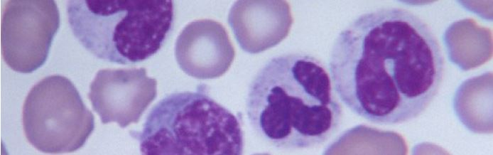

# Leukemia Classification

Veronica Agnolutto | Data PT Barcelona Jun 2020

 

 *It’s not some kind of miracle, cancer doesn’t grow from yesterday to today. It’s a pretty long process. There are signs in the tissue but the human eye has limited ability to detect what may be very small patterns.*

  Regina Barzilay, 
  first winner of the Squirrel AI Award for AI for the Benefit of Humanity  

  

## Contents

- [Overview](Overview)
  - [Data](Data)
  - [Dataset](Dataset)
- [Goal](Goal)

- [ANNa](ANNa)
  - [Meet ANNa](Meet_ANNa)
      - [U-Net](U-Net)
      - [ANNa's engineering](ANNa's_engineering)
      - [Performance Charts](Performance_Charts)
      - [Conclusions](Conclusions)
      - [Future Improvements](Future_Improvements)

- [Project structure](Project_structure)

- [Tools](Tools)
  - [Cloud](Cloud)
  - [Libraries](Libraries)

- [References](References)

## Overview

**Leukemia** is a malignant tumor of white blood cells (leukocytes). In [Acute lymphoblastic](https://en.wikipedia.org/wiki/Acute_lymphoblastic_leukemia) form, it represents 25% of all pediatric cancers.

The task of identifying immature leukemic blasts from normal cells under the microscope is challenging due to **morphological similarity** and labels were annotated by an expert oncologist.

### Data

Data are obtained from a  [Kaggle dataset](https://www.kaggle.com/andrewmvd/leukemia-classification) with more than 15,000 cells'images, some of them of young patients affected by leukemia and others with no leukemia.

Cells have been segmented from microscopic images and are representative of images in the real-world because they contain some staining noise and illumination errors, although these errors have largely been fixed in the course of acquisition.

In total there are **15,135 images** from **118 patients** with two **labelled classes**:

- **all**: Leukemia Blast
- **hem**: Healthy Cells

### Description of the Dataset

**C-NMC Leukemia** (Classification  of Normal vs Malignant Cells) is a folder that contains the data arranged in three folders:

  

where:
  - all: Leukemia cells
  - hem: Normal (healthy) cells

We will use **training_data** to train the model and **validation_data** to evaluate it since this folder contains the labels.

We won't use **testing_data** because images are not labeled and not useful for our project.

## Goal

Tackling one of the major types of childhood cancer by creating a **model** that **classifies** between **diseased** and **healthy cells**.

To do this, we use  **Neural Networks**, a computer system modeled on the **human brain** and **nervous system**.

 

## ANNa

To achieve our goal, we create **ANNa**, an **Artificial Neural Network anti-Leukemia**.

**ANNa** is the combination of a **Convolutional Network** for **Biomedical Image Segmentation** (**U-Net**) and a **Neural Network** for **Binary Classification**.

We choose Convolutional Neural Networks because they are a category of Neural Networks that have proven very effective in areas such as image recognition and classification.

### Meet ANNa

Let's discover **ANNa's Brain**!

In **Medical testing**, **Binary classification** is used to determine if a patient has certain disease (in our case, **Leukemia**) or not.

For this reason, we create a **Brain** made up of two parts:

- 1. **U-Net**: **Convolutional Network** for **Biomedical Image Segmentation**

      **Medical Image Segmentation** is the process of **automatic or semi-automatic detection of boundaries within a 2D or 3D image**.

      - Input: Image shape
      - Output: U-Net output

- 2. **Binary Classification**: **Neural Networks**

        - Input: U-Net output
        - Output: Classification output

### U-Net

Let’s get to a more detailed **implementation of U-Net** by Olaf Ronneberger, Philipp Fischer, and Thomas Brox (2015).

  

  

First sight U-Net has an `U shape`. The architecture is symmetric and consists of two major parts:

  - 1. `contracting path` (left): the general convolutional process;
  - 2. `expansive path` (right): transposed 2d convolutional layers.

The main idea behind CNN is to learn the feature mapping of an image and exploit it to make more **nuanced feature mapping**.

For detailed information about CNN/U-Net structure, please check out these articles:

- [Convolutional Neural Network](https://towardsdatascience.com/a-comprehensive-guide-to-convolutional-neural-networks-the-eli5-way-3bd2b1164a53)
- [U-Net line by line explanation](https://towardsdatascience.com/unet-line-by-line-explanation-9b191c76baf5)

### Classification

The task of the **Neural Network** for **Binary Classification** is to **distinguish** between diseased and healthy cells.

  

  

### Brain engineering

During the training process of a Neural Network, our aim is to **minimize** the **loss function** by updating the values of the parameters and make our predictions as accurate as possible.

We used different techniques to **optimize** the behaviour of our Neuronal Networks.

  - 1. **Optimizer**

      **ANNa** is trained using the optimization algorithm **Adam** (adaptive moment estimation). Adam uses **Momentum** and **Adaptive Learning Rates** to converge faster.

      - **Momentum**: accelerates stochastic gradient descent in the relevant direction, as well as dampening oscillations.
      - **Adaptive Learning Rate**: adjustments to the learning rate in the training phase.

      
 
      

  - 2. **Learning Rate**

      The **learning rate** is a hyperparameter that controls **how much to change the model** in response to the **estimated error** each time the model weights are updated.

      LR = 0,001 (Initial LR for Adam's algorithm)
      
 
      
    
  - 3. **Early Stopping**

      **Early Stopping** is a regularization technique to combat the **overfitting issue**. With Early Stopping, we just stop training as soon as the validation error reaches the minimum.
      
 
      

  - 4. **Image Data Augmentation**

      Image data augmentation is used to artificially expand the size of a training dataset by creating **modified versions of original images**.

      In our case, data augmentation does not give any benefit to the training so we decide not to use it.

### Performance Charts

Once you fit a deep learning neural network model, you must evaluate its performance on a test dataset (in our case, **validation_data**).

- 1. **Classification Report**

     Model Evaluation Metrics:
    - **Accuracy** the ratio of the True predicted values to the Total predicted values.
    - **Precision** for class 1 is, out of all predicted class values like 1, how many actually belong to class 1.
    - **Recall** class 1 is, out of all the values that actually belong to class 1, how much is predicted as class 1.
    - **F1-score** seeks a balance between precision and recall, it takes into account **false negatives** and **false positives**.

    
 
    

- 2. **Confusion Matrix**

    A confusion matrix tells us the performance of our algorithm or test, where the rows are the actual data and the columns the predictions.

      **TP** = **True Positive** Real: Leukemia | Prediction: Leukemia

      **FP** = **False Positive** Real: No Leukemia | Prediction: Leukemia

      **TN** = **True Negative** Real: No Leukemia | Prediction: No Leukemia

      **FN** = **False Negative** Real: Leukemia | Prediction: No Leukemia

      
 
      

- 3. To understand our model’s performance at a deeper level we compute the sensitivity and the specificity.

      - **Sensitivity** measures the proportion of true positives that are correctly identified.
      - **Specificity** measures the proportion of true negatives.

      
 
      

- 4. **ROC curve**

    **AUC-ROC** curve is a performance measurement for classification problem. It tells how much **model** is capable of **distinguishing** between **classes**.

 

### Conclusions

In this project, we learned how to use the **Keras** deep learning library to train a Convolutional Neural Network for **Leukemia classification**.

A total of 10661 images belonging to two classes are included in the training dataset:

- Positive (+): 7272 images
- Negative (-): 3389 images

We can see there is a class imbalance in the data with almost 2x more positive samples than negative samples.

**ANNa** is able to recognize the diseased cells but has some difficulty recognizing the healthy ones.

The class imbalance, along with the challenging nature of the dataset, lead to us obtaining:
  - ~**60%** **accuracy**
  - ~**82% sensitivity (N)**
  - ~**18% specificity (N)**
  - ~**82% fall-out** (probability of false allert)

**ANNa** is confirming Kaggle’s results and since this is her first training we can say that is behaving quite successfully!

 

### Future Improvements

- Improve **ANNa's performance** choosing other parameters.

- **ANNa's Implementation** using **Pytorch**, developed by Facebook’s AI research group. The advantage of Pytorch is that we can have more flexibility and control than Keras.

- Apply **ANNa** to **biomedical images** that require to **localise** the **area of abnormality**.

- Keep learning Deep Learning and Computer Vision!

 

## Project structure  

- **README.md** Description of the project.
- **src** Images and resources.
- **input** Link to the [Kaggle dataset](https://www.kaggle.com/andrewmvd/leukemia-classification)  
- **notebooks**
  - **modules** Folder containing all the custom function created with Python.
  - **1.EDA**
  - **2.Image_preprocessing**
  - **3.ANNa**
  - **4.Test**

- **output**
  - **arrays** ([Text document with the link to my Drive Folder](https://drive.google.com/drive/folders/1eyf80KBw0Q5j4iKq1sy1xnl38hcvsawP?usp=sharing))
  - **csv**
  - **models**
  - **viz**

- **.gitignore**

 

## Tools

**Cloud**

This project was done entirely in the **cloud**, using:

- **Google Drive**: cloud to store files
- **Google Colab**: platform
- **Python Compiler Editor**: run Python code in your browser directly

**Google Colab** is an online cloud based platform based on the Jupyter Notebook framework, designed mainly for use in ML and deep learning operations.

Other advantage of **Colab** is data versatility, allowing to ‘mount’ Google Drive onto our notebook.

**Libraries**

- File management: sys | os | glob
- Google: drive | colab
- Data Analysis: Numpy | Pandas
- Image manipulation: OpenCV | PIL
- Visualization: Matplotlib | Seaborn
- Neural Networks: TensorFlow | Keras
- Metrics: Scikit-learn

## References

**Google Colab**
- [Google Colab](https://medium.com/swlh/machine-learning-google-colab-why-when-and-how-to-use-it-9624e34abd6d)

**Deep Learning**
- [Deep Learning and Medical Image Analysis with Keras](https://www.pyimagesearch.com/2018/12/03/deep-learning-and-medical-image-analysis-with-keras/)
- [Types of Convolutions in DL](https://towardsdatascience.com/types-of-convolutions-in-deep-learning-717013397f4d)
- [Convolutional Neural Network](https://towardsdatascience.com/a-comprehensive-guide-to-convolutional-neural-networks-the-eli5-way-3bd2b1164a53)
- [ML Model Regularization](https://towardsdatascience.com/machine-learning-model-regularization-in-practice-an-example-with-keras-and-tensorflow-2-0-52a96746123e)
- [Keras metrics](https://neptune.ai/blog/keras-metrics)
- [How to Calculate Precision, Recall, F1 and More for Deep Learning Models](https://machinelearningmastery.com/how-to-calculate-precision-recall-f1-and-more-for-deep-learning-models/)
- [f1 score in keras metrics](https://medium.com/@aakashgoel12/how-to-add-user-defined-function-get-f1-score-in-keras-metrics-3013f979ce0d)

**UNE-t**
- [U-Net line by line explanation](https://towardsdatascience.com/unet-line-by-line-explanation-9b191c76baf5)
- [Regularization Techniques](https://medium.com/intelligentmachines/convolutional-neural-network-and-regularization-techniques-with-tensorflow-and-keras-5a09e6e65dc7)
